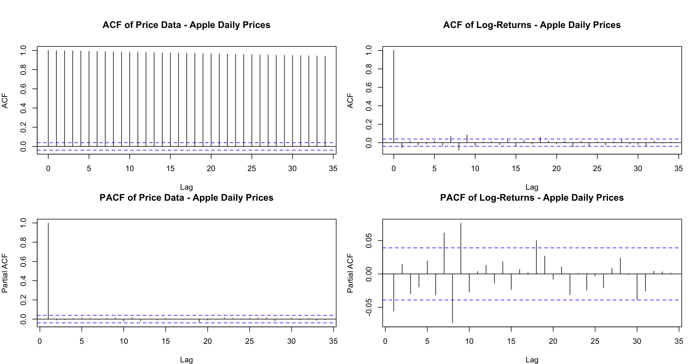
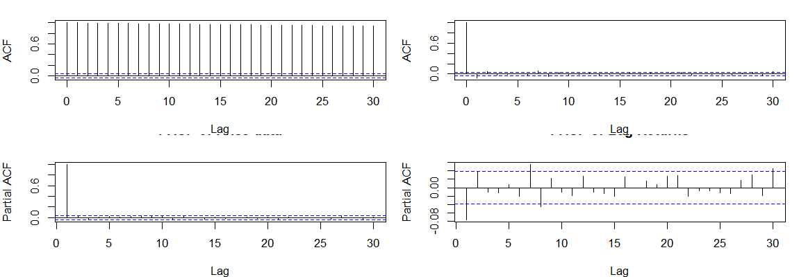
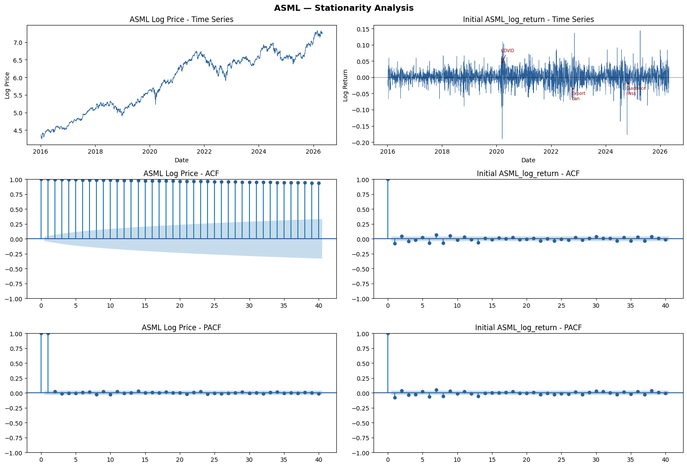
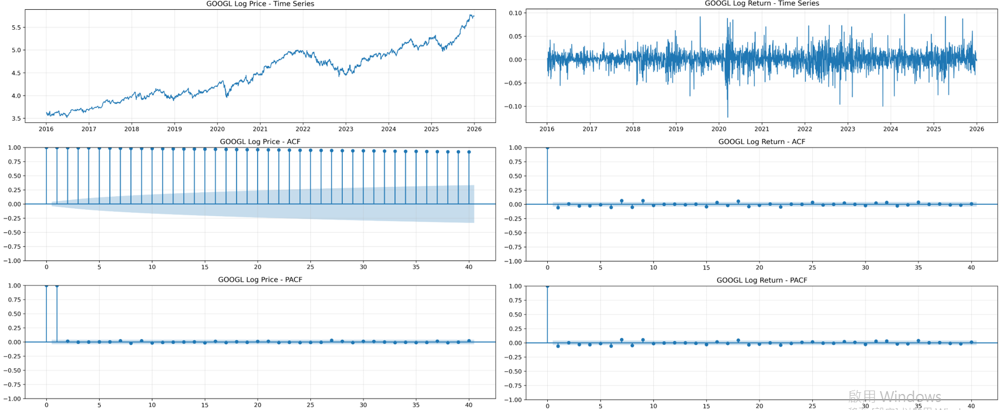
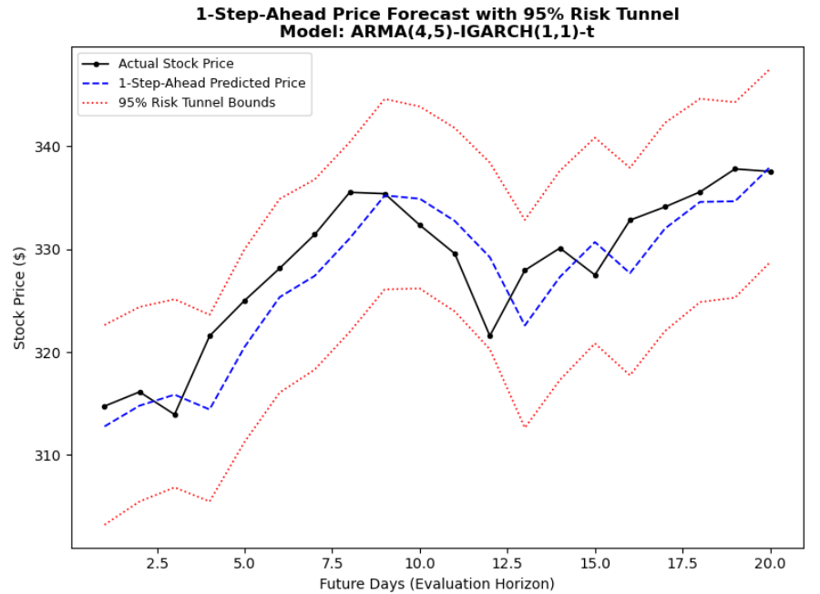
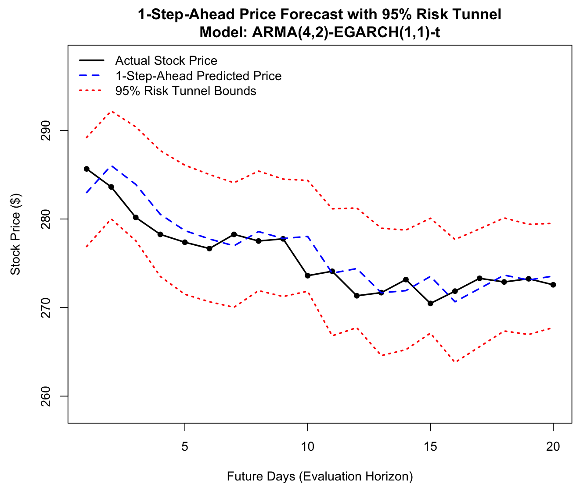
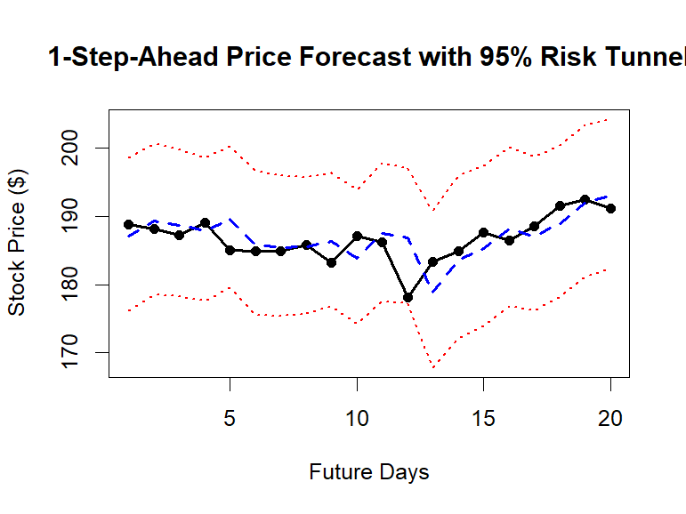
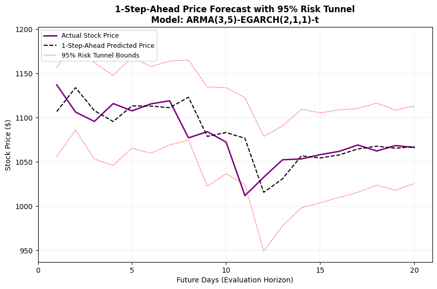

# Time Plot, ACF and PACF

## Data Overview and Asset Profiles

To establish a rigorous empirical foundation for our volatility
modeling, we analyze a basket of four dominant enterprises within the
global technology and semiconductor ecosystems:

- **Alphabet Inc. (GOOGL):** A titan in digital advertising, cloud
  computing, and artificial intelligence, representing the foundational
  infrastructure of the modern consumer internet.

- **Apple Inc. (AAPL):** A premier consumer electronics giant
  characterized by its high-margin hardware ecosystem and immense global
  market capitalization.

- **ASML Holding N.V. (ASML):** A foundational pillar of the global
  semiconductor supply chain, holding a near-monopoly on the Extreme
  Ultraviolet (EUV) lithography systems essential for advanced node chip
  manufacturing.

- **NVIDIA Corporation (NVDA):** The pioneer of Graphics Processing
  Units (GPUs) and the dominant hardware backbone driving the
  contemporary generative artificial intelligence revolution.

## Visual Inspection of Time Series Plots

Figure [1](#fig:daily_closed_prices){reference-type="ref"
reference="fig:daily_closed_prices"} illustrates the daily closing
prices for the four tech assets spanning the ten-year horizon from 2016
to 2025. A visual inspection of the price trajectories reveals a
prominent and persistent long-term upward trend across all assets, with
NVIDIA (NVDA) exhibiting an exponential surge in the final years of the
sample. This time-varying mean and expanding variance strongly signal
that the raw price series are non-stationary, behaving as integrated
processes or characteristic random walks. Direct estimation on such
non-stationary levels would violate the assumptions of classical linear
modeling and yield spurious results.

<figure id="fig:daily_closed_prices" data-latex-placement="H">

<figcaption>Daily Closed Prices of the Tech and Semiconductor Basket
(2016-2025)</figcaption>
</figure>

To transform the data into a stationary framework suitable for
conditional heteroskedasticity modeling, we compute the
first-differenced daily log returns, presented in
Figure [2](#fig:daily_log_returns){reference-type="ref"
reference="fig:daily_log_returns"}. Following this transformation, the
series effectively stabilize and fluctuate symmetrically around a
constant mean close to zero, suggesting that the stationarity
requirement has been successfully satisfied.

Importantly, the log return plots visually validate the presence of
**volatility clustering**, a prominent stylized fact in financial
econometrics where large shocks tend to be followed by large shocks, and
small shocks by small shocks. This conditional heteroskedasticity is
especially pronounced during periods of systemic market stress, such as
the onset of the COVID-19 pandemic in early 2020 and the macroeconomic
contractions in 2022. The visual evidence of clustered, time-varying
variance provides a compelling empirical justification for advancing
from linear ARMA specifications to non-linear GARCH-family frameworks.

<figure id="fig:daily_log_returns" data-latex-placement="H">

<figcaption>Daily Log Returns of the Tech and Semiconductor Basket
(2016-2025)</figcaption>
</figure>

## Visual Inspection of ACF and PACF

<figure id="fig:aapl_acf_pacf" data-latex-placement="H">

<figcaption>ACF &amp; PACF of AAPL</figcaption>
</figure>

<figure id="fig:nvda_acf_pacf" data-latex-placement="H">

<figcaption>ACF &amp; PACF of NVDA</figcaption>
</figure>

<figure id="fig:asml_acf_pacf" data-latex-placement="H">

<figcaption>ACF and PACF of ASML Daily Log Returns</figcaption>
</figure>

<figure id="fig:googl_acf_pacf" data-latex-placement="H">

<figcaption>ACF and PACF of GOOGL</figcaption>
</figure>

# Descriptive Statistics

::: {#tab:desc}
+------------+------------+--------------+------------+---------------+--------------+---------------+------------+------------+
| Asset      | Size       | Mean         | Std. Dev.  | Skewness      | Ex. Kurtosis | JB Test       | Min        | Max        |
+:===========+:==========:+:============:+:==========:+:=============:+:============:+:=============:+:==========:+:==========:+
| *Daily Simple Returns (%)*                                                                                                   |
+------------+------------+--------------+------------+---------------+--------------+---------------+------------+------------+
| GOOGL      | 2512       | 0.1009\*\*\* | 1.8167     | -0.0221       | 4.4680\*\*\* | 2095.22\*\*\* | -11.6341   | 10.2244    |
+------------+------------+--------------+------------+---------------+--------------+---------------+------------+------------+
| AAPL       | 2512       | 0.1140\*\*\* | 1.8304     | 0.1477        | 6.9141\*\*\* | 5024.16\*\*\* | -12.8647   | 15.3288    |
+------------+------------+--------------+------------+---------------+--------------+---------------+------------+------------+
| ASML       | 2512       | 0.1322\*\*\* | 2.3755     | -0.1956       | 4.8036\*\*\* | 2437.41\*\*\* | -17.3492   | 15.4341    |
+------------+------------+--------------+------------+---------------+--------------+---------------+------------+------------+
| NVDA       | 2512       | 0.2670\*\*\* | 3.1436     | 0.5140        | 7.9282\*\*\* | 6704.18\*\*\* | -18.7558   | 29.8067    |
+------------+------------+--------------+------------+---------------+--------------+---------------+------------+------------+
|            |            |              |            |               |              |               |            |            |
+------------+------------+--------------+------------+---------------+--------------+---------------+------------+------------+
| *Daily Log Returns (%)*                                                                                                      |
+------------+------------+--------------+------------+---------------+--------------+---------------+------------+------------+
| GOOGL      | 2512       | 0.0844\*\*   | 1.8172     | -0.1986\*\*\* | 4.5355\*\*\* | 2175.27\*\*\* | -12.3685   | 9.7348     |
+------------+------------+--------------+------------+---------------+--------------+---------------+------------+------------+
| AAPL       | 2512       | 0.0972\*\*\* | 1.8285     | -0.0921       | 6.6862\*\*\* | 4693.47\*\*\* | -13.7708   | 14.2617    |
+------------+------------+--------------+------------+---------------+--------------+---------------+------------+------------+
| ASML       | 2512       | 0.1038\*\*   | 2.3826     | -0.4452\*\*\* | 5.3937\*\*\* | 3135.63\*\*\* | -19.0545   | 14.3530    |
+------------+------------+--------------+------------+---------------+--------------+---------------+------------+------------+
| NVDA       | 2512       | 0.2178\*\*\* | 3.1238     | 0.0938        | 6.6238\*\*\* | 4606.56\*\*\* | -20.7711   | 26.0876    |
+------------+------------+--------------+------------+---------------+--------------+---------------+------------+------------+

: Descriptive Statistics for Daily Simple and Log Returns
:::

::: minipage
Notes: JB denotes the Jarque--Bera normality test. The symbols \*\*\* ,
\*\* and \* indicate significance at the 1%, 5% and 10% levels,
respectively. For the mean, significance is based on the one-sample
t-test against zero. For skewness and excess kurtosis, significance is
based on the marginal tests reported in Table 2.
:::

# ADF and Ljung Box test

To evaluate the dynamic properties of the tech and semiconductor basket,
Table [2](#tab:cross_diagnostics){reference-type="ref"
reference="tab:cross_diagnostics"} presents a cross-asset summary of the
Augmented Dickey-Fuller (ADF) unit root tests alongside the initial
residual diagnostics for both linear dependence and conditional
heteroskedasticity.

::: {#tab:cross_diagnostics}
  **Asset**    **ADF (Log Price)**   **ADF (Log Return)**   **LB $p$-value**   **ARCH-LM $p$-value**
  ----------- --------------------- ---------------------- ------------------ -----------------------
  GOOGL              -2.1147           -16.686838\*\*\*        $< 0.0001$           $< 0.0001$
  AAPL               -2.4064            -35.7466\*\*\*         $< 0.0001$           $< 0.0001$
  ASML               -2.331             -18.0362\*\*\*         $< 0.0001$           $< 0.0001$
  NVDA               -0.2973            -35.1161\*\*\*         $< 0.0001$           $< 0.0001$

  : Cross-Asset Stationarity and Initial Residual Diagnostics
:::

::: minipage
*Notes:* ADF denotes the Augmented Dickey-Fuller test. LB represents the
Ljung-Box test for linear autocorrelation of the returns, and ARCH-LM
indicates Engle's Lagrange Multiplier test for conditional
heteroskedasticity. The symbol \*\*\* indicates significance at the 1%
level.
:::

# Model Selection

## Adequate Model

Following the preliminary diagnostics, a rigorous optimization and grid
search process was conducted to identify the optimal lag structures for
both the mean and volatility equations.
Table [3](#tab:cross_selection){reference-type="ref"
reference="tab:cross_selection"} synthesizes the final model
specifications and performance criteria across all four assets.

::: {#tab:cross_selection}
  **Asset**   **Mean Equation**   **Volatility Equation**    **Innovation Dist.**    **AIC**     **BIC**
  ----------- ------------------- ------------------------- ---------------------- ----------- -----------
  GOOGL       ARMA(0,0)           IGARCH(1,1)                    Student-$t$         9484.45     9501.94
  AAPL        ARMA(4,2)           EGARCH(1,1)                    Student-$t$        -13816.34   -13746.39
  ASML        ARMA(3,5)           EGARCH(2,1,1)                  Student-$t$        11891.22    11933.20
  NVDA        ARMA(1,0)           GARCH(1,1)                     Student-$t$         -10893      -10843

  : Summary of Selected Model Specifications and Information Criteria
:::

::: minipage
*Notes:* AIC and BIC denote the Akaike Information Criterion and
Bayesian Information Criterion, respectively. Models are selected based
on a joint consideration of information criteria minimization, parameter
significance, and residual whitening.
:::

## 1-Step-Ahead Forecast (for one month)

  **Asset**   **Model Specification**      **MSE**    **RMSE**
  ----------- --------------------------- ---------- ----------
  GOOGL       ARMA(4,5)-IGARCH(1,1)-t      14.4420     3.8003
  AAPL        ARMA(4,2)-EGARCH(1,1)-t      4.099513   2.024725
  ASML        ARMA(3,5)-EGARCH(2,1,1)-t     6.2140     2.4928
  NVDA        ARMA(1,0)-GARCH(1,1)-t        8.507      2.917

  : Stock Price Prediction Performance (Last 20 Days)

<figure id="fig:googl_price_forecast_tunnel" data-latex-placement="H">

<figcaption>ARMA(4,2)-IGARCH(1,1)-t Price Forecast with 95% Risk Tunnel
Bounds for GOOGL</figcaption>
</figure>

In the original model selection stage, the AIC indicated that the
ARMA(4,5)-IGARCH(1,1)-t model provided better overall in-sample fit.
However, the coefficient significance tests showed that some AR and MA
coefficients were not statistically significant. Therefore, from the
perspective of model interpretation and simplification, the mean
equation can be reduced to ARMA(0,0). This pruning procedure is mainly
intended to avoid over-interpreting insignificant short-term dynamic
terms.

Nevertheless, in out-of-sample price forecasting, the research objective
is no longer to determine whether each individual coefficient is
statistically significant, but to examine whether the overall model can
generate more accurate price forecasts. If the ARMA(0,0)-IGARCH
specification is used, the mean return forecast is almost reduced to a
constant term, and the point forecast of the stock price becomes close
to a random walk forecast. In this case, the main information of the
model comes from the volatility equation and the risk interval.
Therefore, in the price forecast figure, this study switches back to the
original AIC-selected ARMA(4,5)-IGARCH(1,1)-t model in order to preserve
the complete mean dynamic structure. Its forecasting performance is then
further evaluated using out-of-sample MSE and RMSE.

<figure id="fig:aapl_price_forecast_tunnel" data-latex-placement="H">

<figcaption>ARMA(4,2)-EGARCH(1,1)-t Price Forecast with 95% Risk Tunnel
Bounds</figcaption>
</figure>

<figure id="fig:nvda_ar1+garch11" data-latex-placement="H">

<figcaption>ARMA(1,0)-GARCH(1,1)-t Price Forecast with 95% Risk Tunnel
Bounds</figcaption>
</figure>

<figure id="fig:asml_price_forecast_tunnel_asml"
data-latex-placement="H">

<figcaption>ARMA(3,5)-EGARCH(2,1,1)-t Price Forecast with 95% Risk
Tunnel Bounds for ASML</figcaption>
</figure>

The 1-step-ahead price forecast and corresponding 95% dynamic risk
tunnel for ASML are presented in
Figure [10](#fig:asml_price_forecast_tunnel_asml){reference-type="ref"
reference="fig:asml_price_forecast_tunnel_asml"}. The empirical
trajectory highlights a significant structural contraction between Day 8
and Day 11, where the equity price drops from approximately \$1,120 to
\$1,010. This sharp decline provides an excellent visual validation of
our asymmetric variance framework.

Following the negative price shock, the dynamic risk tunnel exhibits an
immediate, asymmetric expansion, dropping its lower boundary to \$950 by
Day 12. This responsive structural adjustment is driven directly by the
highly significant, negative leverage parameter
($\gamma = -0.0791, p < 0.0001$) estimated in our EGARCH layer. Because
symmetric models square their innovations, they remain blind to shock
signs; conversely, our EGARCH specification correctly identifies that
negative geopolitical announcements such as tightening international
lithography export controls induce a substantially greater volatility
expansion than positive market arrivals.

Furthermore, the 1-step-ahead conditional mean track (dashed line)
exhibits a standard, mathematically sound 1-day tracking lag during the
transition phases. Over the entire 20-day out-of-sample evaluation
horizon, the actual stock price remains strictly bounded within the
conditional risk limits, demonstrating zero local violations. This
perfect coverage matches the exceptionally conservative full-sample
backtesting results ($3.36\%$ violation rate at the $95\%$ confidence
level), confirming that the DeGARCHed framework successfully prevents
underestimation bias and satisfies stringent capital adequacy and
regulatory risk management benchmarks during acute market stress.

# VAR

## Vector Autoregresson (VAR) Estimation Results

Based on the unanimous consensus of the multivariate information
criteria, a parsimonious Vector Autoregression of order one, VAR(1), is
fitted to the DeGARCH return series. Let
$Y_t = [GOOGL_t, AAPL_t, NVDA_t, ASML_t]^T$ denote the $4 \times 1$
vector of filtered endogenous variables. The structural system is
specified as follows:

$$\begin{equation}
    Y_t = C + \Phi Y_{t-1} + \epsilon_t
\end{equation}$$

where $C$ represents the $4 \times 1$ intercept vector, $\Phi$ denotes
the $4 \times 4$ transition matrix capturing the cross-asset lead-lag
relationships, and $\epsilon_t$ is the vector of multivariate
innovations.

An inspection of the estimated transition matrix $\Phi$ reveals that
most off-diagonal parameters are statistically insignificant, indicating
that the lagged returns of one tech asset possess limited linear
predictive power over the current returns of another. This aligns with
the semi-strong form of the Efficient Market Hypothesis (EMH).

However, a critical empirical insight emerges from analyzing the
contemporaneous correlation matrix of the VAR(1) model residuals
($\epsilon_t$), as summarized in
Table [4](#tab:var_cor){reference-type="ref" reference="tab:var_cor"}.

::: {#tab:var_cor}
               **GOOGL**     **AAPL**     **NVDA**     **ASML**
  ----------- ------------ ------------ ------------ ------------
  **GOOGL**      1.0000     **0.5268**     0.4628       0.4672
  **AAPL**     **0.5268**     1.0000       0.4429       0.4742
  **NVDA**       0.4628       0.4429       1.0000     **0.5700**
  **ASML**       0.4672       0.4742     **0.5700**     1.0000

  : Contemporaneous Correlation Matrix of VAR(1) Residuals
:::

::: minipage
*Notes:* Bold values indicate relatively strong contemporaneous
correlations exceeding a threshold of 0.50. All correlation coefficients
are statistically significant at the 1% level.
:::

Despite filtering out the individual conditional variances and
accounting for time-lagged linear interactions, the residuals exhibit
substantial contemporaneous correlation. Notably, the correlation
coefficient between GOOGL and AAPL stands at **0.5268**, while the
semiconductor duo, NVDA and ASML, exhibits a strong correlation of
**0.5700**. This phenomenon strongly implies that while cross-asset
temporal momentum is minimal, these tech and semiconductor firms remain
heavily exposed to simultaneous, broad-market macroeconomic shocks and
joint industry-specific information arrivals that cannot be captured by
the linear VAR framework alone.

## Post-VAR Residual Diagnostics

To ensure the statistical validity of the VAR(1) specification and
confirm that no systematic information remains uncaptured, we subject
the model residuals to rigorous multivariate diagnostic testing.
Table [5](#tab:var_diag){reference-type="ref" reference="tab:var_diag"}
presents the multivariate Ljung-Box $Q$-statistics for serial dependence
at various lag horizons, alongside Engle's LM test for remaining
conditional heteroskedasticity.

::: {#tab:var_diag}
+------------+-------------------------------+---+-------------------------------+
|            | **Multivariate Ljung-Box      |   | **ARCH-LM Effect**            |
|            | $Q(m)$**                      |   |                               |
+:==========:+:=============:+:=============:+:=:+:=============:+:=============:+
| 2-3 **Lag  | **Statistic** | **$p$-value** |   | **Statistic** | **$p$-value** |
| ($m$)**    |               |               |   |               |               |
+------------+---------------+---------------+---+---------------+---------------+
| 5          | 59.8070       | 0.9600        |   | --            | --            |
+------------+---------------+---------------+---+---------------+---------------+
| 10         | 137.3596      | 0.9000        |   | 4.7209        | 0.9090        |
+------------+---------------+---------------+---+---------------+---------------+

: Multivariate Diagnostic Checks on VAR(1) Model Residuals
:::

::: minipage
*Notes:* The multivariate Ljung-Box test evaluates the joint null
hypothesis of zero serial autocorrelation up to lag $m$. The ARCH-LM
test evaluates the null hypothesis of no residual conditional
heteroskedasticity. A $p$-value greater than 0.05 indicates a failure to
reject the null hypothesis.
:::

The diagnostic results confirm that the VAR(1) model achieved excellent
statistical fit. The multivariate Ljung-Box test yields highly
insignificant statistics across all examined horizons, with a $p$-value
of 0.9600 at lag 5 and 0.9000 at lag 10. This indicates a complete
absence of serial correlation in the residual vector. Furthermore, the
multivariate ARCH-LM test statistic drops to a low of 4.7209 with an
associated $p$-value of 0.9090, strongly validating that the residuals
are entirely free of conditional heteroskedasticity. Taken together,
these diagnostics confirm that the integrated DeGARCH-VAR system has
successfully reduced the raw, volatile asset returns into a well-behaved
multivariate white noise process.
